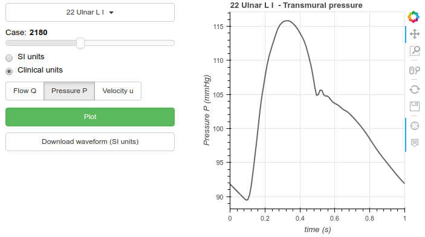

# __openBF__-db

[](https://github.com/INSIGNEO/openBF)

[](https://insigneo.org/)
[](http://www.compbiomed.eu/)


[](https://opensource.org/licenses/Apache-2.0)

The code in this repository can be used to generate physiological virtual population of vascular networks. The pulse wave propagation can be simulated with [openBF](https://github.com/INSIGNEO/openBF) solver. The network is based on [ADAN56 model](https://github.com/alemelis/openBF-hub/tree/master/models/boilleau2015benchmark/adan56).

__Requirements__:
- Python + [SALib](https://github.com/SALib/SALib) + NumPy
- Julia + [openBF](https://github.com/INSIGNEO/openBF)

### Usage

- First, the lower and upper bounds for each parameter should be defined. Fill `parameters/*.txt` with parameter ranges (min/max).
- Create SALib input files as

```bash
$ cd parameters
$ python write_ranges.py
$ cd ..
```

- SALib is used to sample input points via the Latin Hypercube method

```bash
$ python setup_simulations.py <N, number of samples>
```

This will generate a folder with as many input sub-folder as `N`.

- Simulations can be run as

```bash
$ julia run_simulations.jl 1 <N>
```

Alternatively, on SGE systems, use the batch script

```bash
$ qsub run_array.sh
```

- :clock1: Wait...

<!-- ### Results

Explore the dataset with the interactive GUI

 -->
